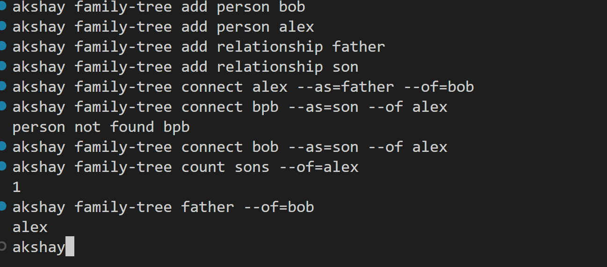

# family-tree

## Run Locally
install go (https://go.dev/doc/install)

clone repository
```sh
git clone https://github.com/akshaym-3255/family-tree.git
```

run 
```sh
go install
```
this will build go project and add compiled binary to GOPATH
make sure path of GOPATH exits in PATH variable


## Usage
to add a person
```sh
family-tree add person <person name>
```
 
 to add relationship 
```sh
family-tree add relationship <relation>
```

to define relationship
```sh
family-tree connect <person_name> --as=<relation> --of=<person_name>
```

to get count
```sh 
family-tree count <relation> --of=<person_name>
```

to get father

```sh
family-tree father --of=<person-name>
```

## output


